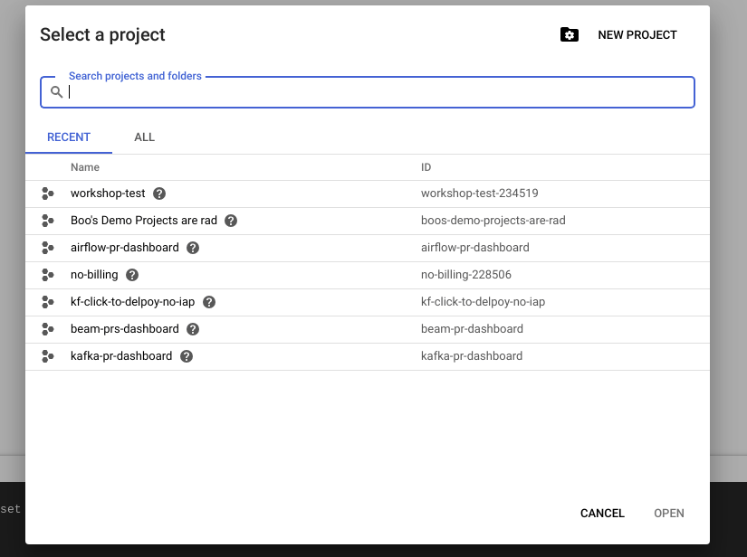
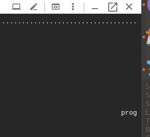
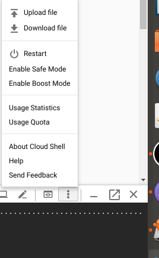
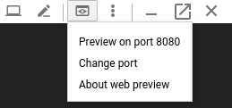
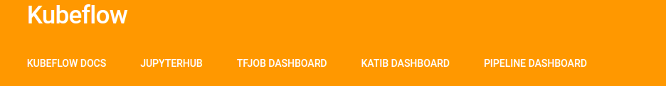
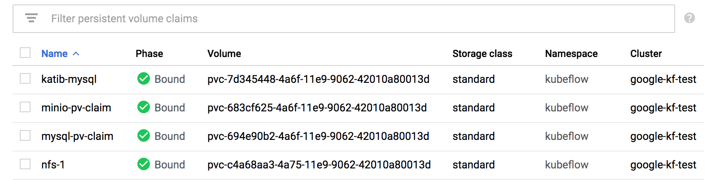

# Cross-cloud model training and serving with Kubeflow

This tutorial is designed to get you off-to-the races with cross-cloud Kubeflow.
If you don't already have a username and password for Google Cloud & Azure from the instructor go head and get one.

**Note: If you're looking at this and the images are broken [click here](https://github.com/intro-to-ml-with-kubeflow/intro-to-ml-with-kubeflow-examples/blob/master/multi-cloud/README.md)**


**Note: If you find bugs, or have suggestions please consider e-mailing us, or submitting a PR if you know how to fix or improve it**

## Motivation


## Solution guide

If at any point you get lost, that's totally normal. Feel free to look at the fancy (we use bash!) [solution shell scripts https://github.com/intro-to-ml-with-kubeflow/intro-to-ml-with-kubeflow-examples/tree/master/multi-cloud](https://github.com/intro-to-ml-with-kubeflow/intro-to-ml-with-kubeflow-examples/tree/master/multi-cloud).

### If it all catches on fire

**Note:*** If you get into a really bad state there is also a cleanup script you may find useful.
Manually deleting the Kubernetes cluster can leave you in a weird state, since the GCP deployment has a number of ancilary service deployed along side.
The cleanup script is at https://github.com/intro-to-ml-with-kubeflow/intro-to-ml-with-kubeflow-examples/blob/master/multi-cloud/cleanup.sh 

## Set up

Kubeflow can be installed and deployed on many environments.
For today's tutorial we will focus on using Google, IBM, & Azure.
The provided set up script is designed to be used within a Google Cloud Console instance, however you are free to modify it to run locally or do your own set-up.

### Logging in to cloud console

If you already have a gcloud account you may find it easier to use incognito mode. You can log in to the cloud console by going to https://console.cloud.google.com . 
Once you're in the default project should already be selected but if not you can select it by clicking on the project drop down in the top left


Then selecting the project. Everyone may have a different project name, don't worry about this.


### Connecting to your Google Cloud Shell

You can lunch Google Cloud Shell by clicking on the >_ icon in the top right if you have gcloud installed in your laptop (make sure to use the workshop account so you don't get billed).


Note: there is a gcloud alpha ssh command, but we'll be use the webpreview which doesn't work out of the box with this.


This will give you a cloud shell, but before you dive in please enable boost mode by click on the 3 dots and selecting enable boost mode.





#### Optional: Using screen

Since conference WiFi is unpredictable, you may wish to use [screen](https://www.rackaid.com/blog/linux-screen-tutorial-and-how-to/).
This will allow you to re-connect your terminal session in another connection 

### Setting up your instance & clusters

While there are many ways to set up Kubeflow, in the interest of speed we will start with using a fast setup script in this directory (`fast_setup.sh`).
`fast_setup.sh` will do the following for you:

* Download Kubeflow and it dependencies
* Download Google & Azure's command line tools (if needed)
* Enable various components in 
* Set up a GKE and EKS cluster (named google-kf-test & azure-kf-test)
* Creates your first Kubeflow App on GKE with some special customizations to avoid waiting for certificate provissioning

```bash
curl https://raw.githubusercontent.com/intro-to-ml-with-kubeflow/intro-to-ml-with-kubeflow-examples/master/multi-cloud/fast-start.sh -o fast-start.sh
chmod a+x fast-start.sh
./fast-start.sh
source ~/.bashrc
```

At that point it's going to be on you to start your Kubeflow adventure!

#### Alternatives

There is also [Kubeflow's click to deploy interface](https://deploy.kubeflow.cloud/#/deploy) (which can set up or skip IAP as desired) -- but to make this more cloud agnostic we avoided that option.


In addition to generating K8s configurations, Kubeflow also has the tools (for some platforms) to generate all of the ancillary configuration (enabling services, creating a K8s cluster, etc.).


`fast-start.sh` takes advantage of  `kfctl.sh` GCP platform generation and manually disables IAP mode.
For now the Azure resources are created manually inside of fast-start, but Azure has been added as a supported platform to `kfctl` in the master branch of Kubeflow.

### Loading your Kubeflow application

To support disabling IAP mode we've generated your GCP Kubeflow app and made some non-standard configuration changes.
To hide all our dirty laundry, we've done this by starting a Kubeflow application for you and setting some hidden parameters (you can look inside of fast-start.sh if you're curious).
To load your application and apply Kubeflow's Kubernetes configuration you run:


```bash
pushd g-kf-app
source env.sh
```

Kubeflow's main entry point is `kfctl.sh`, this has been added to your path with the fast-start but otherwise you can find this in the `${KUBEFLOW_SRC}/scripts/kfctl.sh`.
Now that you have your application loaded and a kubernetes cluster created, it's time to apply Kubeflow's kubernetes configuration:

```bash
kfctl.sh apply k8s
```


*Note*: This will take awhile, however if you're stuck waiting for the ambassador to deploy, double check that your cloudshell is running in boost mode. If it's not you may want to restart in boost mode, although you'll need to delete the deployment in deployment manager and start over, but trust us this is the best time to start over rather than 2 hours later.

Now you can see what's running in your cluster with:

```bash
kubectl get all --all-namespaces
```

You should see a variety of things deployed including the ambassador in the Kubeflow namespace e.g.:

```
kubeflow             deployment.apps/ambassador                                 3         3         3            3           19h
```

### Connecting to your Kubeflow Ambassador

The Kubeflow Ambassador gives you a nice web UI with which you can access many of Kubeflow's components.
Normally on GCP you'd set up Kubeflow in IAP mode which would give you easy access to the ambassador.

Since we're in a hurry today though we'll use port forwarding and the cloudshell web preview which is also pretty cool.

```bash
kubectl port-forward svc/ambassador -n kubeflow 8080:80 &
```

The cloudshell web preview button looks like and should be at the top of your cloudshell web interface


The default port should be 8080 which is the correct one, but you change it if not:



Now you can launch web preview and you should get the Kubeflow Ambassador page which looks something like:




### Adding components to your Kubeflow application


We want to install a few additional packages because we're going to be using
additional services.
Currently Kubeflow manages packages with [ksonnet](https://ksonnet.io/), although [this is changing](https://groups.google.com/forum/#!searchin/kubeflow-discuss/ksonnet%7Csort:date/kubeflow-discuss/Zg14_Ok7XH4/iL7bHZo6CgAJ).
`kfctl.sh` creates a ksonnet application inside of your kubeflow application called `ks_app`.
Ksonnet Packages which are shipped with kubeflow can be installed by going into the `ks_app` directory with and running `ks pkg install kubeflow/[package_name]`.


Our example uses [seldon core](https://www.seldon.io/) for model serving, called `seldon` inside of Kubeflow. Go ahead and install it now :)


You can make sure it's installed by running `ks pkg list` and looking for `*` next to seldon:

```
programmerboo@cloudshell:~/g-kf-app-4/ks_app (workshop-test-234519)$ ks pkg list
REGISTRY NAME                    INSTALLED
======== ====                    =========
kubeflow application             *
kubeflow argo                    *
kubeflow automation
kubeflow chainer-job
kubeflow common                  *
kubeflow examples                *
kubeflow gcp                     *
kubeflow jupyter                 *
kubeflow katib                   *
kubeflow kubebench
kubeflow metacontroller          *
kubeflow modeldb                 *
kubeflow mpi-job                 *
kubeflow mxnet-job
kubeflow new-package-stub
kubeflow nvidia-inference-server
kubeflow openmpi
kubeflow openvino                *
kubeflow pachyderm
kubeflow pipeline                *
kubeflow profiles                *
kubeflow pytorch-job             *
kubeflow seldon                  *
kubeflow tensorboard
kubeflow tf-batch-predict
kubeflow tf-serving              *
kubeflow tf-training             *
```

If this doesn't work for you, remember we have the [solutions](https://github.com/intro-to-ml-with-kubeflow/intro-to-ml-with-kubeflow-examples/blob/master/multi-cloud/solution2.sh) in the [repo](https://github.com/intro-to-ml-with-kubeflow/intro-to-ml-with-kubeflow-examples/tree/master/multi-cloud].

Once you've installed your new component you have the opportunity to configure it with:

```bash
ks param set [component_name] [config_key] [value]
```

For now, we don't need to configure anything inside of seldon, so we can use the default configuration.


If you change the configuration of a component (or if it's the first time installing it), you need to regenerate the yaml files for that component. This is done `ks generate`. We'll do this using the seldon prototype and seldon component:

```bash
ks generate [prototype] [component]
```

You can verify the components with:

```bash
ks component list
```


**Possibly not needed**
Create cluster role binding.
```bash
kubectl create clusterrolebinding kf-admin \
     --clusterrole=cluster-admin --user=$(gcloud config get-value account)
```

Now we can use `kfctl.sh` to apply our newly generated yaml. Make sure to run this in the root of your kubeflow project.

```
cd ..
kfctl.sh apply k8s
```


Now you can see what's running in your cluster with:

```bash
kubectl get all --all-namespaces
```

#### Optional: Adding Helm/Tiller for seldon monitoring

We don't require it for our example, but seldon has some additional monitoring tools you can install using helm/tiller.

#### Optional: Adding vendor/external components to your Kubeflow application

If you want to add packages which aren't part of the Kubeflow core,
you can add additional registries with `ks registry add`.
For example adding the h2o registry could be done with:

```bash
ks registry add h2o-kubeflow https://github.com/h2oai/h2o-kubeflow/tree/master/h2o-kubeflow
```

Now that you've add a new registry you can list the components and install them in the same way as with first party components up above.

### Setting up the requirements to train a simple model

#### Installing Argo

Argo is a workflow management tool, and serves as the basis of Kubeflow pipelines.
Since we're using an older example as our base though, we will directly use argo for our training and serving jobs.

To download `argo` run.
```
curl -sSL -o ~/argo https://github.com/argoproj/argo/releases/download/v2.2.1/argo-linux-amd64
chmod +x ~/argo
```

To "install" `argo` :

```bash
kubectl create ns argo
kubectl apply -n argo -f https://raw.githubusercontent.com/argoproj/argo/v2.2.1/manifests/install.yaml
```

Now before you just blindly copy and paste the next part- update your NAME and EMAIL
```
kubectl create clusterrolebinding YOURNAME-cluster-admin-binding --clusterrole=cluster-admin --user=YOUREMAIL@gmail.com
```

This all seems like a _lot_ of cluster role binding... probably don't need all of these.

```
kubectl create rolebinding default-admin --clusterrole=admin --serviceaccount=default:default
kubectl create clusterrolebinding sa-admin --clusterrole=cluster-admin --serviceaccount=kubeflow:default
```

#### A place for your model to call home.

A persistent volume claim.

```
kubectl create -f https://raw.githubusercontent.com/intro-to-ml-with-kubeflow/intro-to-ml-with-kubeflow-examples/master/multi-cloud/config/pv-claim.yaml -n kubeflow
```

Check to make sure it worked with

```
kubectl get pvc -n kubeflow
```

OR

https://console.cloud.google.com/kubernetes/storage

should look like this:




### Train the Model


#### Clone Example Seldon

This entire example is based loosely on https://github.com/kubeflow/example-seldon
we'll want to clone this repository to get the code and config files it uses.

```
cd ~/
git clone https://github.com/kubeflow/example-seldon
```


#### Optional- Monkey with the existing model.

Some people just want to do the basics- but not you- you're  a hard charger- you
want to do all the stuff. In this little section we're going to edit the model.

The original model that is being trained is a `RandomForrestClassifier` which is
a pretty trashy way to categorize handwritten digits.

Luckily `sklearn` has a nice consistent API so we can swap out about any classifier in its place.

To do this, in the place where you cloned `example-seldon` let's go edit the training file.

Go to `example-seldon/models/sk_mnist/train`.  Check the file `create_model.py`.

The lines of interest are 39 through 42
```
classifier = RandomForestClassifier(n_estimators=30)

classifier.fit(data[:n_samples // 2], targets[:n_samples // 2])
```

Thanks to the magic of python- you don't even need to change the second line.

You'll need to import your new classifier (up towards the beginning), and here on line 39
declare classifier as what ever new and better one you want.

While you're in here, please take a look at various things like the rest of `create_model.py`, `Dockerfile`, and `build_and_push.sh`.

These are all interesting things, but going in to the finer details of creating a workflow is a bit out of scope, and we feel you can figure
it out pretty easily on your own once this is done.


### Ok Now train it.

IF you didn't monkey with the model:
```bash
cd $EXAMPLE_SELDON/workflows
~/argo submit training-sk-mnist-workflow.yaml -n kubeflow
```

ELSE IF you monkeyed with the model, you'll need to train and build a new image:

```bash
cd $EXAMPLE_SELDON/workflows
~/argo submit training-sk-mnist-workflow.yaml -n kubeflow -p build-push-image=true
```

Which will build and push the new docker image as part of the work flow. This workflow
has a `build-push-image` parameter that will reload the image. You can check that out [here](

### Ok now monitor it.

The easiest way to monitor the model progress is using the following two shell commands:

```
kubectl get pods -n kubeflow | grep sk-train
## AND
~/argo list -n kubeflow
```

These will hopefully show a successfully running set of pods / job.

### Serve the Model

Once training has finished, we can serve it with:

```
cd $EXAMPLE_SELDON/workflows
~/argo submit serving-sk-mnist-workflow.yaml -n kubeflow -p deploy-model=true
```


#### Query the Model

#### Monitor the serving

If you set up the optional seldon analytics...


## Starting a new Kubeflow project for Azure/IBM

Now that we've got everything working on GCP, it's time to take our model and serve it on another cloud provider.

First we'll connect to our Azure cluster:

```bash
az aks get-credentials --name azure-kf-test --resource-group westus
```

Since Azure platform isn't supported in 0.4.1  we'll instead use it as a "raw" k8s cluster.
Kubeflow provides `kfctl.sh` is also used to bootstrap a new kubeflow project:


```bash
kfctl.sh init azure-app --platform none
cd azure-app
kfctl.sh generate k8s
kfctl.sh apply k8s
```

### Getting your model ready

If you're running short on time, feel free to skip re-training your model and instead copy your model over.

#### Optional: re-training


#### Optional: copy your model.


### Serving
